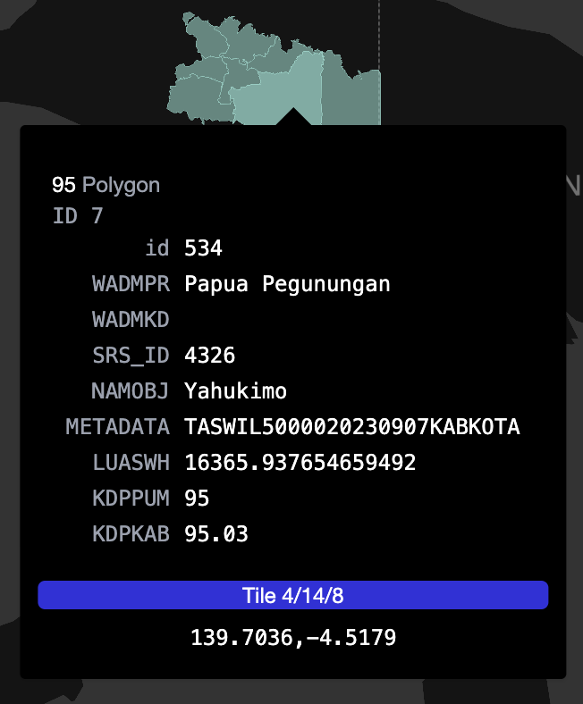

# PMTiles Data - Administrasi Kabupaten/Kota Indonesia

## Deskripsi

Data ini merupakan **vector tile** berbasis **PMTiles** untuk wilayah administrasi kabupaten/kota di Indonesia. Sumber data diambil dari [BIG](https://tanahair.indonesia.go.id/portal-web/) pada Maret 2025. Proses data dimulai dari **PostgreSQL/PostGIS** dan lanjutkan menggunakan **Tippecanoe** untuk mengonversi subset GeoJSON menjadi PMTiles.

Proses singkat:

1. Ambil data dari **Database** menggunakan `ogr2ogr`.
2. Ekstrak kolom penting seperti `OBJECTID`, `NAMOBJ`, `KDPPUM`, `KDPKAB`, dan `geom`.
3. Gunakan **ST_Force2D** untuk memastikan geometri dua dimensi.
4. Generate PMTiles per `KDPPUM` *(kode provinsi)* menggunakan **Tippecanoe**, sehingga setiap tile memiliki ID unik per provinsi.

---

## Preview Data

Kamu bisa **preview data** secara interaktif melalui link berikut:
[PMTiles Preview](https://pmtiles.io/)

---

## Properties / Fields

Setiap feature memiliki properti berikut:

| Field      | Deskripsi                         |
| ---------- | --------------------------------- |
| `id`       | ID unik dari `OBJECTID`           |
| `WADMPR`   | Kode provinsi                     |
| `SRS_ID`   | Sistem referensi koordinat (EPSG) |
| `NAMOBJ`   | Nama kabupaten/kota               |
| `METADATA` | Metadata tambahan                 |
| `LUASWH`   | Luas wilayah (hektar)             |
| `KDPPUM`   | Kode wilayah (unit pemekaran)     |
| `KDPKAB`   | Kode kabupaten                    |
| `geom`     | Geometri multipolygon 2D          |

Untuk tampilan visual properti, lihat gambar:


---

## Struktur Folder

```
pmtiles_prov_kabkot/
├─ 11.pmtiles
├─ 12.pmtiles
├─ ...
script/
├─ generate_pmtiles_per_kabupaten.sh
```

* `pmtiles_prov_kabkot/` → Hasil PMTiles siap pakai.
* `script/` → Script untuk generate data.

---

## Cara Menggunakan

1. Letakkan PMTiles di server/public folder.
2. Gunakan **MapLibre / Mapbox GL JS** untuk load tiles:

```javascript
map.addSource("adm_kabkot", {
    type: "vector",
    url: "/pmtiles/11.pmtiles"
});

map.addLayer({
    id: "adm_kabkot-fill",
    type: "fill",
    source: "adm_kabkot",
    "source-layer": "11",
    paint: { "fill-color": "#f0c420", "fill-opacity": 0.5 }
});
```

3. Gunakan `feature.id` untuk interaksi (hover, click, feature state).

**Lebih lengkapnya pergi [kesini](https://github.com/ngrhadi/indonesia-vector-tiles/tree/main/example)**

---

## Catatan

* PMTiles dihasilkan **per KDPPUM**, sehingga satu file mewakili subset wilayah per provinsi.
* Properti `id` digunakan sebagai **feature.id** untuk MapLibre/Mapbox.
* Digenerate menggunakan [tippecanoe](https://github.com/felt/tippecanoe) v2.80.0 dan GDAL 3.0.4
* Baca dokumentasi PMTiles [disini](https://github.com/protomaps/PMTiles)
